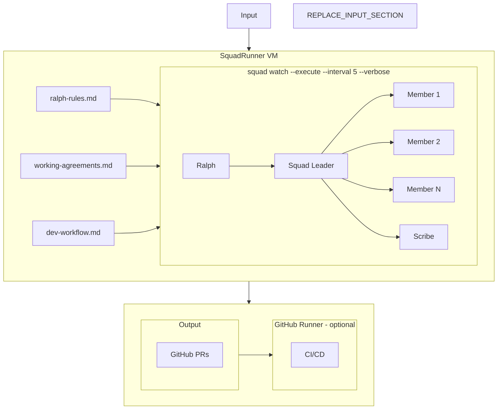

# SquadRunner

**Cloud-based agentic development with Squad and GitHub**

SquadRunner is an architecture pattern for orchestrating multi-agent AI workflows. It combines a local CUA (Computer Use Agent), Squad, a persistent cloud VM, and GitHub to create an autonomous development pipeline.

## How It Works



## Prerequisites

| Dependency | Description |
|------------|-------------|
| [GitHub Copilot CLI](https://github.com/githubnext/github-copilot-cli) | GitHub API access and authentication |
| [Squad](https://github.com/anthropics/squad) | Human-directed AI development teams through GitHub Copilot |

## The Stack

| Component | Role |
|-----------|------|
| **Claw-based CUA** | Chief of Staff — bridges human PO and AI agents |
| **Squad** | Human-directed AI development teams through GitHub Copilot |
| **SquadRunner VM** | Cloud execution — Linux VM running `squad watch` via SSH/tmux |
| **GitHub** | Backlog + PRs — issues drive work, labels route to agents |

## Squad Agents

Agents are project-specific. Define your team in `.squad/team.md`:

- **Squad Leader** — triages issues, breaks down epics, dispatches work
- **Specialist agents** — backend, frontend, data, docs, etc.
- **Ralph** — polls GitHub, routes issues based on labels
- **Scribe** — logs session history, commits decisions

## SquadRunner VM Setup

### VM Dependencies

Install all dependencies on the VM:

```bash
# Update system
sudo apt-get update && sudo apt-get upgrade -y

# Install Node.js 20
curl -fsSL https://deb.nodesource.com/setup_20.x | sudo -E bash -
sudo apt-get install -y nodejs

# Install tmux
sudo apt-get install -y tmux

# Install GitHub Copilot CLI
npm install -g @githubnext/github-copilot-cli

# Install Squad
npm install -g @anthropic/squad

# Authenticate with GitHub
gh auth login

# Verify
node --version && gh --version && squad --version
```

### SSH Config

```
Host squadrunner
  HostName <vm-public-ip>
  User squad
  IdentityFile ~/.ssh/id_rsa
```

### Running Squad Watch

```bash
tmux new-session -d -s squad
tmux send-keys -t squad 'cd ~/repos/your-project && squad watch --execute --interval 5 --verbose' Enter
```

### Windows Terminal Integration

```json
{
  "name": "SquadRunner",
  "commandline": "ssh squadrunner -t 'tmux attach -t squad || tmux new -s squad'",
  "icon": "🤖"
}
```

## The Workflow

1. **Groom** — Human + CUA audit GitHub backlog, set priorities and labels
2. **Watch** — Ralph scans issues, routes to Squad Leader or direct to agents
3. **Execute** — Squad Leader dispatches specialists in parallel
4. **Review** — PRs opened as drafts, human reviews via sitrep command
5. **Merge** — Approved PRs merge, issues close, cycle repeats

## Monitoring

### Sitrep Command

```bash
ssh squadrunner "tmux send-keys -t squad 'sitrep' Enter"
ssh squadrunner "tmux capture-pane -t squad -p | tail -50"
```

### Log File

```bash
ssh squadrunner "tmux pipe-pane -t squad 'cat >> ~/squad-watch.log'"
```

## Results

In our first production run:

- **3 PRs in 15 minutes** while the human watched
- **Parallel execution** — multiple agents running simultaneously
- **Autonomous overnight** — Squad works while you sleep
- **Full traceability** — every decision logged, every commit attributed

## Cost

| Resource | Monthly Cost |
|----------|-------------|
| Small Linux VM (2 vCPU, 4GB) | ~$15-30 |
| GitHub (existing) | $0 |
| Total | ~$15-30/month |

## License

MIT

---

*This architecture pattern is not documented anywhere else. Novel as of May 2026.*


