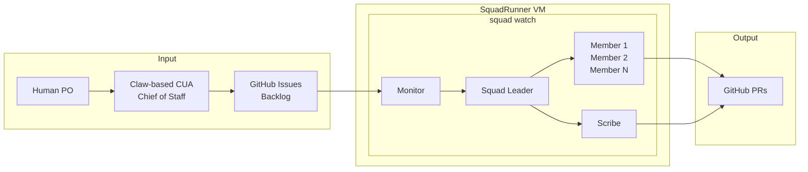

# SquadRunner

**Cloud-based agentic development with Squad CLI and GitHub**

SquadRunner is an architecture pattern for orchestrating multi-agent AI workflows. It combines a local CUA (Computer Use Agent), the Squad CLI framework, a persistent cloud VM, and GitHub to create an autonomous development pipeline.

## The Stack

| Component | Role |
|-----------|------|
| **Claw-based CUA** | Chief of Staff — bridges human PO and AI agents, skills, M365 integration |
| **Squad CLI** | Multi-agent framework — define your team in `.squad/team.md` |
| **SquadRunner VM** | Cloud execution — Azure VM running `squad watch` via SSH/tmux |
| **GitHub** | Backlog + PRs — issues drive work, labels route to agents |
| **GH Copilot CLI** | Session-based development — issues, PRs, code in one terminal |

## How It Works



## Squad Agents

Agents are project-specific. Define your team in `.squad/team.md`:

- **Squad Leader** — triages issues, breaks down epics, dispatches work
- **Specialist agents** — backend, frontend, data, docs, etc.
- **Monitor** — polls GitHub, routes issues based on labels
- **Scribe** — logs session history, commits decisions

## Definition of Ready (DOR)

For Squad to pick up an issue, it needs:

- `squad` label (base requirement)
- `priority:P{N}` label (P0 = critical, P1 = high, P2 = normal, P3 = skip)

Optional routing:
- `squad:{member}` — direct to a specific agent
- No routing label → Squad Leader triages

## SquadRunner VM Setup

### Prerequisites

- Linux VM (Ubuntu 22.04+ recommended)
  - 2 vCPU, 4GB RAM minimum
  - SSH access enabled
- SSH key pair configured
- GitHub CLI (`gh`) installed and authenticated
- Node.js 20+
- tmux

### SSH Config

> "I have a VM at `<ip>` — set up SSH so I can connect as `squadrunner`"

```
Host squadrunner
  HostName <vm-public-ip>
  User squad
  IdentityFile ~/.ssh/id_rsa
```

### Squad CLI Installation

> "Install Squad CLI on the VM and authenticate with GitHub"

```bash
curl -fsSL https://deb.nodesource.com/setup_20.x | sudo -E bash -
sudo apt-get install -y nodejs
sudo npm install -g @bradygaster/squad-cli
gh auth login
```

### Running Squad Watch

> "Start squad watch on my project repo"

```bash
tmux new-session -d -s squad
tmux send-keys -t squad 'cd ~/repos/your-project && squad watch --execute --interval 5 --verbose' Enter
```

### Windows Terminal Integration

> "Add a terminal shortcut to connect to SquadRunner"

```json
{
  "name": "SquadRunner",
  "commandline": "ssh squadrunner -t 'tmux attach -t squad || tmux new -s squad'",
  "icon": "🤖"
}
```

## The Workflow

1. **Groom** — Human + CUA audit GitHub backlog, set priorities and labels
2. **Watch** — Monitor scans issues, routes to Squad Leader or direct to agents
3. **Execute** — Squad Leader dispatches specialists in parallel
4. **Review** — PRs opened as drafts, human reviews via sitrep command
5. **Merge** — Approved PRs merge, issues close, cycle repeats

## Monitoring

### Sitrep Command

> "Check on the Squad"

```bash
ssh squadrunner "tmux send-keys -t squad 'sitrep' Enter"
ssh squadrunner "tmux capture-pane -t squad -p | tail -50"
```

### Log File

> "Make sure squad watch logs everything"

```bash
ssh squadrunner "tmux pipe-pane -t squad 'cat >> ~/squad-watch.log'"
```

## Results

In our first production run:

- **3 PRs in 15 minutes** while the human watched
- **Parallel execution** — multiple agents running simultaneously
- **Autonomous overnight** — Squad works while you sleep
- **Full traceability** — every decision logged, every commit attributed

## Cost

| Resource | Monthly Cost |
|----------|-------------|
| Small Linux VM (2 vCPU, 4GB) | ~$15-30 |
| GitHub (existing) | $0 |
| Total | ~$15-30/month |

## License

MIT

---

*This architecture pattern is not documented anywhere else. Novel as of May 2026.*
