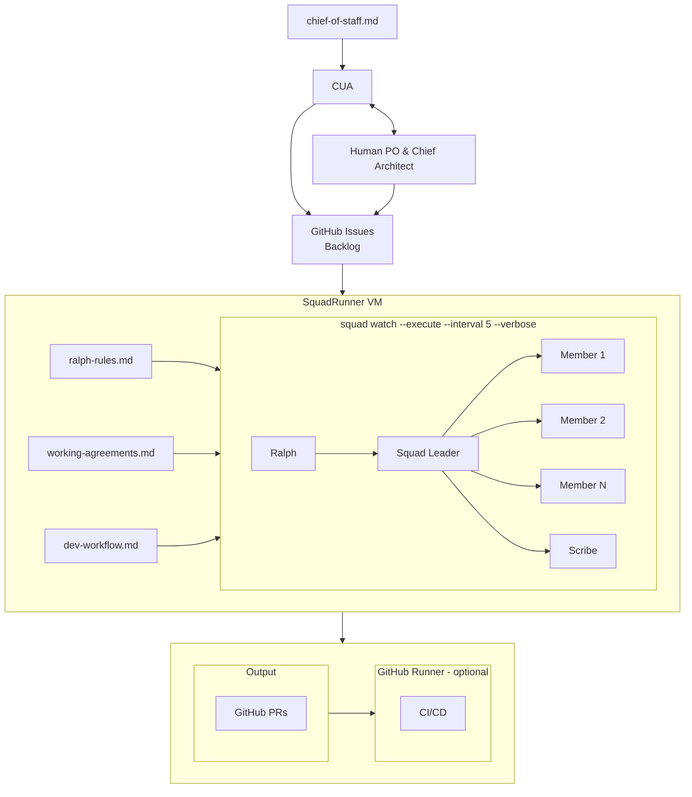

# SquadRunner

**Cloud-based agentic development with Squad and GitHub**

SquadRunner is an architectural pattern for orchestrating multi-agent developer workflows using persistent Squads and a Computer Use Agent.

## How It Works



## Prerequisites

| Dependency | Description |
|------------|-------------|
| [GitHub Copilot CLI](https://github.com/githubnext/github-copilot-cli) | GitHub API access and authentication |
| [Squad](https://github.com/anthropics/squad) | Human-directed AI development teams through GitHub Copilot |

## The Stack

| Component | Role |
|-----------|------|
| **Claw-based CUA** | Chief of Staff — bridges human PO and AI agents |
| **Squad** | Human-directed AI development teams through GitHub Copilot |
| **SquadRunner VM** | Cloud execution — Linux VM running `squad watch` via SSH/tmux |
| **GitHub** | Backlog + PRs — issues drive work, labels route to agents |

## Squad Agents

Agents are project-specific. Define your team in `.squad/team.md`:

- **Squad Leader** — triages issues, breaks down epics, dispatches work
- **Specialist agents** — backend, frontend, data, docs, etc.
- **Ralph** — polls GitHub, routes issues based on labels
- **Scribe** — logs session history, commits decisions

## Setup

**SquadRunner is designed to be set up by a Claw-based CUA.**

See **[SquadRunner Setup](docs/squadrunner-setup.md)** for the prompts to give your CUA. The guide walks through:

1. Provisioning an Azure VM
2. Configuring SSH access
3. Installing dependencies (Node.js, GitHub CLI, tmux)
4. Authenticating with GitHub
5. Starting squad watch

No manual commands required — just copy the prompts and let your CUA execute.

## The Workflow

1. **Groom** — Human + CUA audit GitHub backlog, set priorities and labels
2. **Watch** — Ralph scans issues, routes to Squad Leader or direct to agents
3. **Execute** — Squad Leader dispatches specialists in parallel
4. **Review** — PRs opened as drafts, human reviews via sitrep command
5. **Merge** — Approved PRs merge, issues close, cycle repeats

## Monitoring

### Sitrep Command

```bash
ssh squadrunner "tmux send-keys -t squad 'sitrep' Enter"
ssh squadrunner "tmux capture-pane -t squad -p | tail -50"
```

### Log File

```bash
ssh squadrunner "tmux pipe-pane -t squad 'cat >> ~/squad-watch.log'"
```

## Results

In our first production run:

- **3 PRs in 15 minutes** while the human watched
- **Parallel execution** — multiple agents running simultaneously
- **Autonomous overnight** — Squad works while you sleep
- **Full traceability** — every decision logged, every commit attributed

## Cost

| Resource | Monthly Cost |
|----------|-------------|
| Small Linux VM (2 vCPU, 4GB) | ~$15-30 |
| GitHub (existing) | $0 |
| Total | ~$15-30/month |

## License

MIT

---

*This architecture pattern is not documented anywhere else. Novel as of May 2026.*