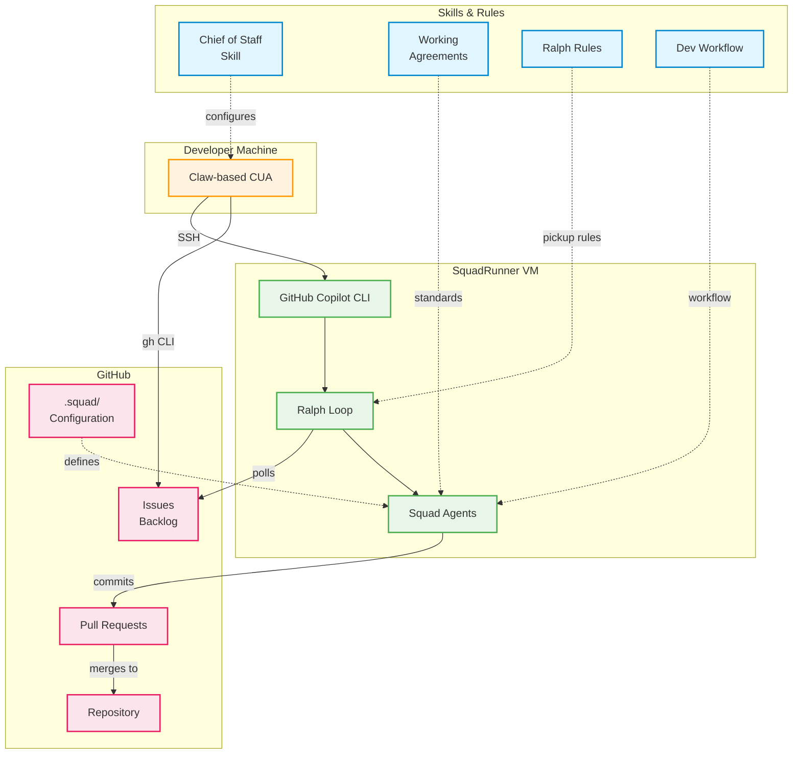
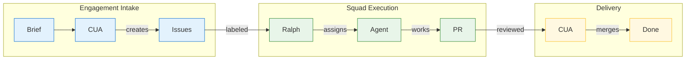
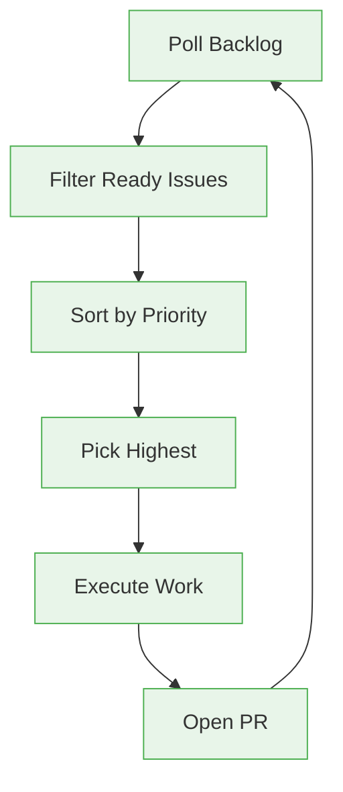
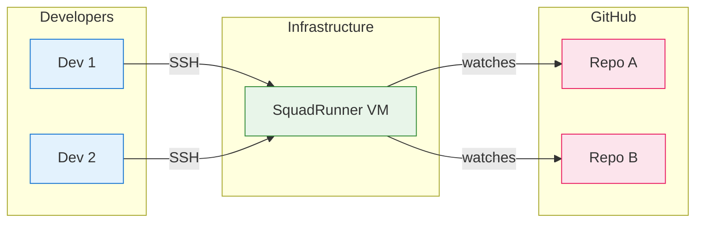

# SquadRunner Architecture

This document describes the SquadRunner system architecture: how a Claw-based CUA (Computer Use Agent) connects to GitHub through a Linux VM running the GitHub Copilot CLI.

## System Overview



## Data Flow



## Components

### 1. Claw-based CUA (Computer Use Agent)

The AI assistant that acts as Chief of Staff. Responsibilities:

- **Backlog Management**: Creates, grooms, and prioritizes issues
- **Engagement Intake**: Processes briefs and dispatches work
- **PR Review**: Reviews and merges completed work
- **Coordination**: Reports status to Product Owner

The CUA operates from the developer's machine and has access to:
- Local squad skills (working agreements, rules)
- SSH connection to SquadRunner VM
- Direct GitHub access via `gh` CLI

**Input**: Chief of Staff Skill defines the PO/CUA relationship and backlog ownership.

### 2. SquadRunner VM

A Linux virtual machine running the GitHub Copilot CLI. Configuration:

| Spec | Value |
|------|-------|
| OS | Ubuntu 22.04 LTS |
| vCPU | 2+ |
| RAM | 4GB+ |
| Storage | 20GB+ |
| Network | Public IP with SSH access |

The VM runs:
- **Node.js 20+**: Runtime for GitHub Copilot CLI
- **GitHub Copilot CLI (`squad`)**: Watches backlog and dispatches work to agents
- **GitHub CLI (`gh`)**: Interacts with GitHub API
- **tmux**: Manages persistent sessions

### 3. Ralph Loop

The dispatcher that picks up work from the backlog.

**Input**: Ralph Rules skill defines:
- Label-based routing (`squad:<member>`)
- Priority ordering (P0 > P1 > P2)
- Skip conditions (P3, blocked, epic)
- Pickup algorithm



### 4. Squad Agents

The workers that execute issues.

**Inputs**:
- Working Agreements skill defines DoR, DoD, ADR conventions
- Dev Workflow skill defines branch/commit/PR flow
- Agent charters in `.squad/agents/*/charter.md`

### 5. GitHub Repository

The system of record. Contains:

- **Issues**: Work items with routing labels
- **Pull Requests**: Code changes for review
- **`.squad/` folder**: Squad configuration
  - `team.md`: Roster and operating model
  - `routing.md`: Label routing rules
  - `agents/*/charter.md`: Agent-specific instructions

## Security Model

### Authentication

| Component | Auth Method |
|-----------|-------------|
| CUA to VM | SSH key (ed25519) |
| VM to GitHub | Personal Access Token or GitHub App |
| CUA to GitHub | `gh auth login` |

### Access Control

- **SSH**: Key-based only, password disabled
- **GitHub**: Fine-grained PAT with repo scope
- **VM Firewall**: Port 22 only

### Secrets Management

| Secret | Location |
|--------|----------|
| SSH private key | `~/.ssh/squadrunner_ed25519` (local) |
| GitHub token | `gh auth` credential store (VM) |

**Never commit secrets to the repository.**

## Deployment Topology



Multiple developers share one VM. Each dev has SSH access.

## Cost Estimate

| Resource | Size | Monthly Cost |
|----------|------|--------------|
| Azure VM | Standard_B2s (2 vCPU, 4GB) | ~$15-30 |
| Storage | 20GB SSD | ~$2 |
| Network | Outbound data | ~$1-5 |
| **Total** | | **~$18-37/month** |

Costs vary by region and usage. Shut down VM when not in use to save money.

## Failure Modes

| Failure | Detection | Recovery |
|---------|-----------|----------|
| VM down | SSH connection fails | Restart VM via Azure portal |
| GitHub Copilot CLI crash | tmux session empty | Restart with `start-watch.sh` |
| GitHub rate limit | API errors in logs | Wait for reset (1 hour) |
| Network issues | Polling timeouts | Auto-retry with backoff |

## Monitoring

### Health Checks

```bash
# Check VM is reachable
ssh squadrunner "echo ok"

# Check GitHub Copilot CLI is running
ssh squadrunner "tmux has-session -t squad && echo running"

# Check recent activity
ssh squadrunner "tail -20 ~/.squad/logs/squad.log"
```

### Sitrep Command

Quick status from the CUA:
1. Send "sitrep" to squad tmux session
2. Wait for response
3. Tail the log
4. Summarize findings

## Related Documentation

- [VM Setup Guide](./vm-setup.md)
- [CUA Setup Guide](./cua-setup.md)
- [New Squad Guide](./new-squad-guide.md)
- [Workflow Guide](./workflow.md)

